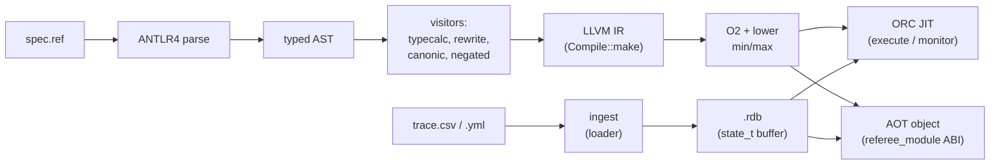

# Architecture

Referee compiles a requirement specification (the REF language) to native code
and runs it over execution traces. This is the map: the pipeline from source to
verdict, the shapes the code generator emits, the two backends (in-process JIT
and ahead-of-time object), the on-disk trace format, and the online monitor
built on top of all of it.

## Contents

- [The pipeline](#the-pipeline)
- [Front end: source to typed AST](#front-end-source-to-typed-ast)
- [Lowering to LLVM IR](#lowering-to-llvm-ir)
  - [The state buffer](#the-state-buffer)
- [Two backends](#two-backends)
- [The trace format](#the-trace-format)
- [The online monitor](#the-online-monitor)
- [Components](#components)

## The pipeline

Two independent inputs meet at run time: the **specification** becomes compiled
code, and the **trace** becomes a state buffer the compiled code reads.

## Front end: source to typed AST

`src/core/referee.g4` is the ANTLR4 grammar. `src/core/antlr2ast.cpp` walks the
parse tree into the typed AST defined in `src/core/syntax.hpp` — `Expr` nodes
(`ExprG`, `ExprUs`, `ExprData`, …) and `Spec` nodes (the Dwyer patterns). A few
syntactic conveniences are desugared here, e.g. `t.elapsed` → `__time__ -
t.__time__`.

Nodes are interned through `src/core/factory.hpp`. Types are interned
process-wide (an `integer` is the same node everywhere, so `typecalc` compares
types by pointer); expression nodes belong to a per-compilation `Arena` and die
with it. A set of visitors then operate on the AST:

- **typecalc** — stamps a resolved `Type*` onto every node, and rejects
  ill-typed programs.
- **rewrite** — canonicalises Dwyer patterns and desugars operators into the
  core set the code generator handles.
- **canonic / negated** — normal forms used by rewrite (e.g. `!(a <=> b)` ↔
  `a ^^ b`, the until/release and since/trigger dualities).
- **printer / csvHeaders / loader** — render the AST, name a trace's columns,
  and read a trace's cells.

## Lowering to LLVM IR

`src/core/visitors/compile.cpp` (`Compile::make`) lowers the AST to an LLVM
module. Temporal operators are lowered to **linear passes** over the trace
(a buffered O(N) fold), not the naive nested scan. Two contexts opt out and take
the scan instead, because a buffer keyed on the state index of the whole trace
does not answer their question: the body of a freeze (`t@(…)`), whose operators
mean something different at each evaluation point, and the body of a Dwyer
*scope* (`before`, `after`, `while`, `between … and …`, `after … until …`),
which is re-evaluated over each segment the scope opens and must read only that
segment. The module the code
generator emits carries, per requirement, several functions distinguished by
arity and name prefix:

| symbol | signature | role |
| ------ | --------- | ---- |
| `<name>` | `i1 (frst, last, conf)` | the requirement, evaluated at the first real state |
| `__col__<name>` | `i1 (frst, last, curr, conf)` | the same body at a caller-chosen state — a run trace's per-state column |
| `__atom__<name>` | `i1 (curr, conf)` | a single-state predicate, no trace — the monitor's per-state hook |
| `__ante__<name>` | `i1 (frst, last, curr, conf)` | an implication's antecedent, for vacuity reporting |
| `__sub__<name>` | `i64 (frst, last, curr, conf)` | a subexpression's per-state value, for `--explain` |
| `__prepare__` | `void (frst, last, conf)` | materialises computed (`data x = expr`) props before any requirement runs |
| `referee_module` | `referee_module_v1 const* ()` | the AOT ABI: a table of requirement pointers + schema |

`frst`/`last`/`curr` are `state_t*`; `conf` is the configuration blob. A run of
LLVM O2 passes plus a custom pass that lowers `llvm.smax/smin/umax/umin`
intrinsics (which the ORC JIT dislikes) finishes the module.

### The state buffer

A `state_t` is `{ int64 time; void* prop[N] }` — a timestamp and one pointer per
`data` signal, in declaration order. States are laid out contiguously with a
fixed **stride** (`rowBytes`), bracketed by two zero sentinels so a temporal
walk always has a stopping point; real states are `[1 .. numStates-2]`. A signal
is read by loading `prop[index]` from the current state; an array signal's
pointer is a `{count, pointer}` descriptor (see
[ragged-arrays.md](ragged-arrays.md)).

## Two backends

**In-process JIT** (`referee execute`, `referee monitor`). `src/driver/
referee.cpp` builds an ORC `LLJIT`, adds the compiled module, binds external
`func` declarations against `.so`s on the `-L` path, runs `__prepare__`, then
calls each requirement function over the state buffer. Needs LLVM present.

**Ahead-of-time object** (`referee build`). The same module is emitted to a
native object exporting one symbol, `referee_module` — a `referee_module_v1`
table (`src/runtime/referee_checker.h`) of requirement function pointers plus
the schema. Linked with `libreferee_rt` (a JIT-free static library:
`database.cpp`, `ingest.cpp`, the loaders, `runtime/checker.cpp`,
`runtime/strfns.cpp`), it produces a standalone checker that reads CSV/YAML/rdb
with **no LLVM, no ANTLR, no `.ref`** at run time — for a device or CI runner.

## The trace format

CSV or YAML is packed into a `.rdb` slab by `src/rdb/ingest.cpp` (the schema
comes from the `.ref`, or is carried by an AOT checker). The per-value packing
is `Loader::load` (`src/core/visitors/loader.cpp`), which turns one typed cell
into its binary form via a `GetCell` closure over the row. A `.rdb` holds the
encoded schema, the state buffer, the conf blob, and a string pool; strings are
interned into the process pool shared with the JIT's literals, so comparisons
are by pointer.

`src/rdb/database.hpp`'s `Reader` opens a `.rdb` (from a path or bytes), fixes up
its pointers, and exposes `ptrFirst()` / `ptrLast()` / `confPtr()` (the state
buffer the compiled code consumes) plus `numStates()` / `rowBytes()`.
`src/rdb/merge.cpp` folds multi-rate sources into one trace.

## The online monitor

`Referee::monitor` (`src/driver/referee.cpp`) checks a trace as it streams,
one CSV row at a time from stdin, reporting a violation the instant it happens.
It is a new **front end over the unchanged backend** — the compiled requirement
and `__atom__` functions are exactly those `execute` uses. Two routes:

- **Prefix path** (the general case). Per row, re-ingest the accumulated CSV and
  run the requirements over the prefix, diffing verdicts. O(N²), but correct for
  every construct — the fallback whenever the fast path does not apply.
- **Atom fast path** (all requirements single-state atoms, no computed props, no
  scopes). Per row, ingest only that row and call `__atom__` on the one state,
  folding into a per-requirement latch: `all` for `G`/`H`, `any` for `F`/`O`,
  `first` for a bare predicate. O(1) per state. Bounded operators (`F[0:5]`) and
  anything the latch cannot express fall back to the prefix path.

A prefix verdict is exact for safety and pessimistic for liveness, so a
mid-stream violation is reported only for a settled failure; the rest finalise
at end of stream, where the online and offline verdicts must agree — the
correctness property the tests pin at every prefix. See
[monitor.md](monitor.md) for the design and
[monitor-implementation.md](monitor-implementation.md) for the build.

## Components

| directory | responsibility |
| --------- | -------------- |
| `src/core` | grammar, AST, interning, the semantic visitors, and the LLVM code generator |
| `src/core/loaders` | CSV / YAML row readers |
| `src/rdb` | the `.rdb` trace format: ingest, `Reader`, schema encode/decode, dump, merge |
| `src/runtime` | the AOT checker ABI and its LLVM-free runtime helpers |
| `src/driver` | the `referee` CLI — compile, execute, build, monitor — and the JIT |
| `src/lsp` | the language server (hover, go-to-def, completion, rename, …) |

See [references.md](references.md) for the temporal-logic and specification-
pattern literature the language is built on.
